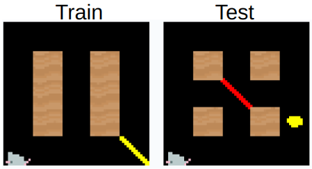
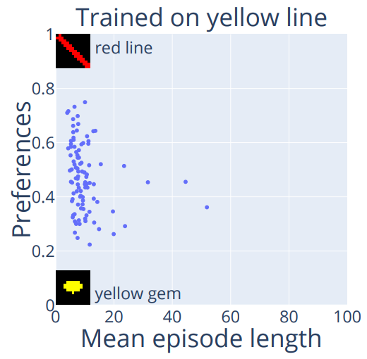

# Colour versus Shape Goal Misgeneralization in Reinforcement Learning: A Case Study
### [arXiv](https://arxiv.org/abs/2312.03762) | [Trained models and test data](https://zenodo.org/records/10200914) | [LessWrong post](https://www.lesswrong.com/posts/G5WjQZL5MqHftsh7D/colour-versus-shape-goal-misgeneralization-in-reinforcement) | [Twitter thread](https://twitter.com/Karolis_Ram/status/1733111006639911024)

This repository contains code for [Colour versus Shape Goal Misgeneralization in Reinforcement Learning: A Case Study](https://arxiv.org/abs/2312.03762), which appeared at [ATTRIB: Workshop on Attributing Model Behavior at Scale at NeurIPS 2023](https://attrib-workshop.cc/).  
We took one of the goal misgeneralization examples (Maze colour vs shape) from [Di Langosco et al. (2022)](https://arxiv.org/abs/2105.14111) and tried to understand how exactly it happens.  We built on top of their code [here](https://github.com/JacobPfau/procgenAISC) and [here](https://github.com/jbkjr/train-procgen-pytorch). See the paper for full details of what was added, summary here:
- Maze environment simplified and new goal objects added. 
- Code to run systematic evaluations of agents and measure capabilities and goal preferences.
- Code to produce plots, videos, and gifs.

## Requirements

To run the training code you will need to install requirements from both [train-procgen](https://github.com/KarolisRam/train-procgen/tree/53856baa18551a2ea904fb383b1668eaf17bf04e) and [procgenAISC](https://github.com/KarolisRam/procgenAISC/tree/abaf50027692460a216cf6ef7c2c044ce53dab0c). To be able to run all notebooks and utils you will also need to run this command:
```bash
pip install -r requirements.txt
```
Training with default settings requires 14GB of GPU memory. See the Tips and Tricks in the end for ways to reduce it.

## Training

To train multiple (5 by default) agents to reach a yellow line with textured backgrounds, run this command:
```bash
. utils/train-many-with-backgrounds.sh 
```
Same, but with black backgrounds:
```bash
. utils/train-many.sh
```
The trained agents will be located in `train-procgen/logs/train/maze_pure_yellowline`. Each agent folder will have a screenshot from a training level for sanity checks. Training on other settings, like the white line or grey backgrounds is explained in the Tips and Tricks below. One agent takes about 40 minutes to train on consumer hardware.

## Evaluation

To evaluate the agents on the same set of 1,000 levels in all the two-object combos from the paper, run:

```bash
. utils/run-maze-many-all-settings.sh 
```

The results will be located in `train-procgen/experiments/results-1000`. Each agent folder will have a screenshot of the first level. The first agent folder will have the screenshots of all 1,000 test levels. Evaluating 100 agents in each two-object combo takes between 1 and 10 hours, depending on the difficulty (yellow lines are easy, invisible objects are hard).

## Plots, videos, gifs, screenshots

After evaluation, you can produce the plots from the paper by running the [notebooks](notebooks).  
To make videos of agents solving the tasks, run:
```bash
. utils/run-maze-many-videos.sh
```
Before running it, you will have to replace the `--model_file` in the `.sh` file above with your own trained models.  
The videos will be placed in `videos`, to turn them into easily shareable screenshots and gifs, run:
```bash
cd utils
python videos-to-pngs-and-gifs.py
```
These will be placed in `video-frames-and-gifs`.
Note that by default the screenshots and the gifs will be 6 times larger than the original 64x64 video. This is because many apps will introduce blurriness when resizing very small images. Adjust the 6x parameter according to your needs. 

## Trained models and evaluation results

You can download all 1,000+ trained models and the results of over 10 million evaluations [here](https://zenodo.org/records/10200914).

## Tips and Tricks

Below is an assorted list of tips and tricks that you can use to make the code do what you want.
- Training to reach different objects: [here](https://github.com/KarolisRam/procgenAISC/blob/abaf50027692460a216cf6ef7c2c044ce53dab0c/procgen/src/games/maze_pure_yellowline.cpp#L35).
- Changing background colour to grey: [here](https://github.com/KarolisRam/procgenAISC/blob/abaf50027692460a216cf6ef7c2c044ce53dab0c/procgen/src/basic-abstract-game.cpp#L980).
- Changing training maze size: [here](https://github.com/KarolisRam/procgenAISC/blob/abaf50027692460a216cf6ef7c2c044ce53dab0c/procgen/src/games/maze_pure_yellowline.cpp#L45).
- Adding back randomness to maze size: [here](https://github.com/KarolisRam/procgenAISC/blob/abaf50027692460a216cf6ef7c2c044ce53dab0c/procgen/src/games/maze_pure_yellowline.cpp#L62).
- Change back mazegen algo: [here](https://github.com/KarolisRam/procgenAISC/blob/abaf50027692460a216cf6ef7c2c044ce53dab0c/procgen/src/games/maze_pure_yellowline.cpp#L75).
- Reduce minibatch size to fit models on smaller GPUs: [here](https://github.com/KarolisRam/train-procgen/blob/53856baa18551a2ea904fb383b1668eaf17bf04e/hyperparams/procgen/config.yml#L87).
- Make screenshots of human and agent view: [here](https://github.com/KarolisRam/procgenAISC/blob/abaf50027692460a216cf6ef7c2c044ce53dab0c/procgen/interactive.py#L18).

## Results

If you train an agent to reach a yellow line, will it prefer a yellow gem or a red line?    
  
It depends on the random seed used for training! Below is a plot showing how training 100 agents (with just the random seed different) produces capable agents with different goal preferences.     
  
See the paper for other results and more details.  

## Citation

Please cite the paper using the below BibTeX:

(TODO)
